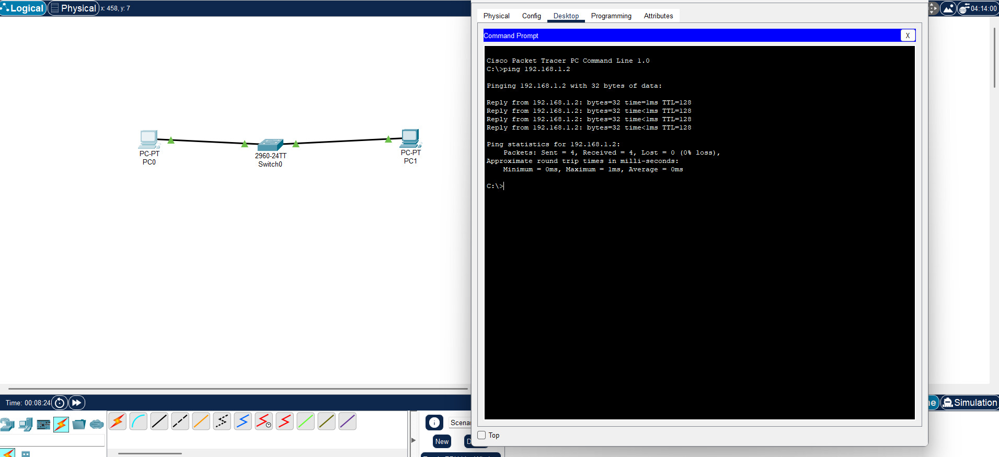

# Lab 1 - Basic PC to PC Network via Switch

**Objective:** Connect two PCs through a switch and verify connectivity.

**Topology:** PC0 — Switch0 (2960-24TT) — PC1

**Configuration:**
- PC0: 192.168.1.1 / 255.255.255.0
- PC1: 192.168.1.2 / 255.255.255.0

**Result:**

Pinging 192.168.1.2 with 32 bytes of data:
Reply from 192.168.1.2: bytes=32 time=1ms TTL=128
Packets: Sent = 4, Received = 4, Lost = 0 (0% loss)

**Status:** Completed

