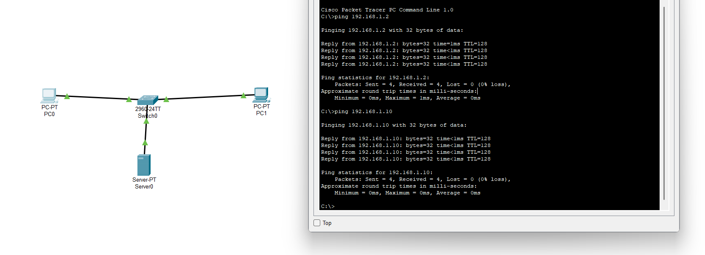
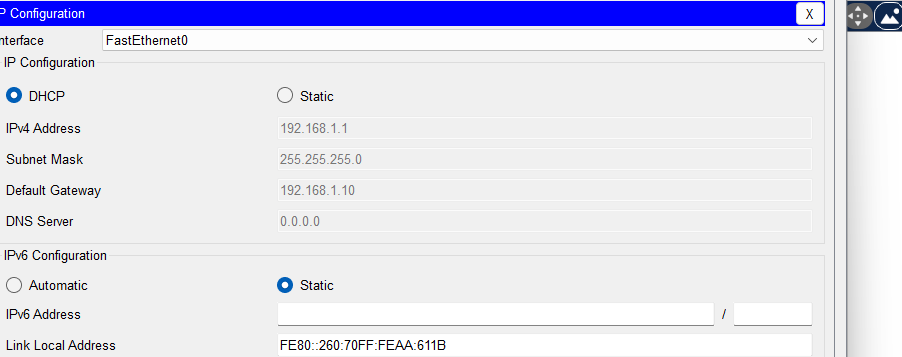

# Lab 2 - DHCP Configuration

**Objective:** Configure a DHCP server to automatically assign IP addresses to network clients.

**Topology:** PC0, PC1 — Switch0 — Server0 (DHCP server)

**Configuration:**
- Server0 (static): 192.168.1.10 / 255.255.255.0
- DHCP pool: starting at 192.168.1.100
- PC0 and PC1 set to DHCP

**Troubleshooting note:** Initially encountered a DHCP failure (APIPA address 169.254.x.x assigned), caused by the DHCP service not being fully configured or saved on the server. Fixed by verifying the server's static IP, re-enabling and saving the DHCP pool settings, and renewing the IP configuration on the client.

**Result:**

Pinging 192.168.1.2 with 32 bytes of data:
Reply from 192.168.1.2: bytes=32 time<1ms TTL=128
Packets: Sent = 4, Received = 4, Lost = 0 (0% loss)

Pinging 192.168.1.10 with 32 bytes of data:
Reply from 192.168.1.10: bytes=32 time<1ms TTL=128
Packets: Sent = 4, Received = 4, Lost = 0 (0% loss)

**Status:** Completed

