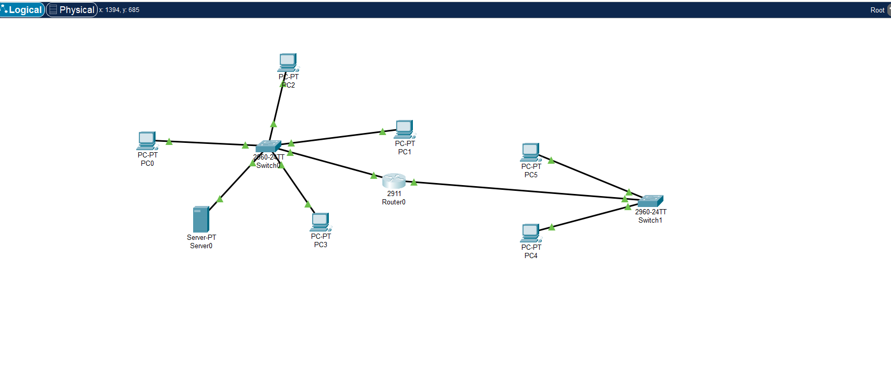
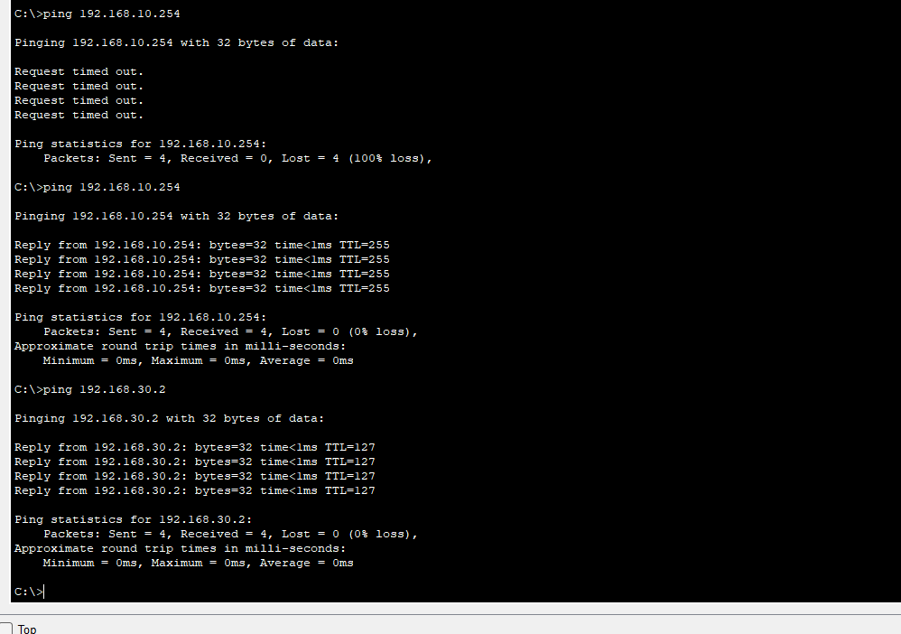
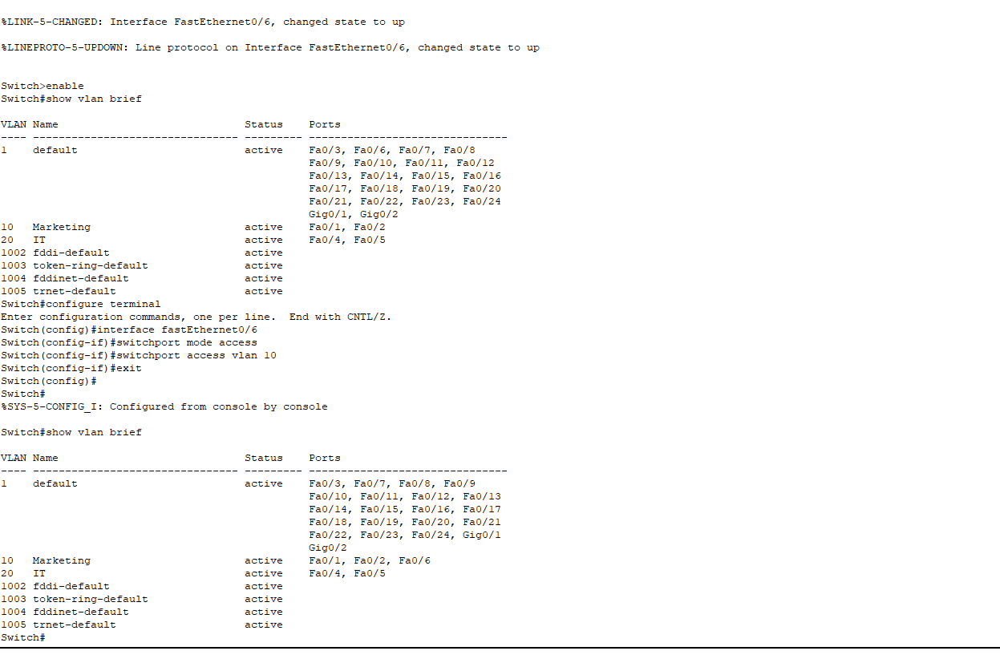
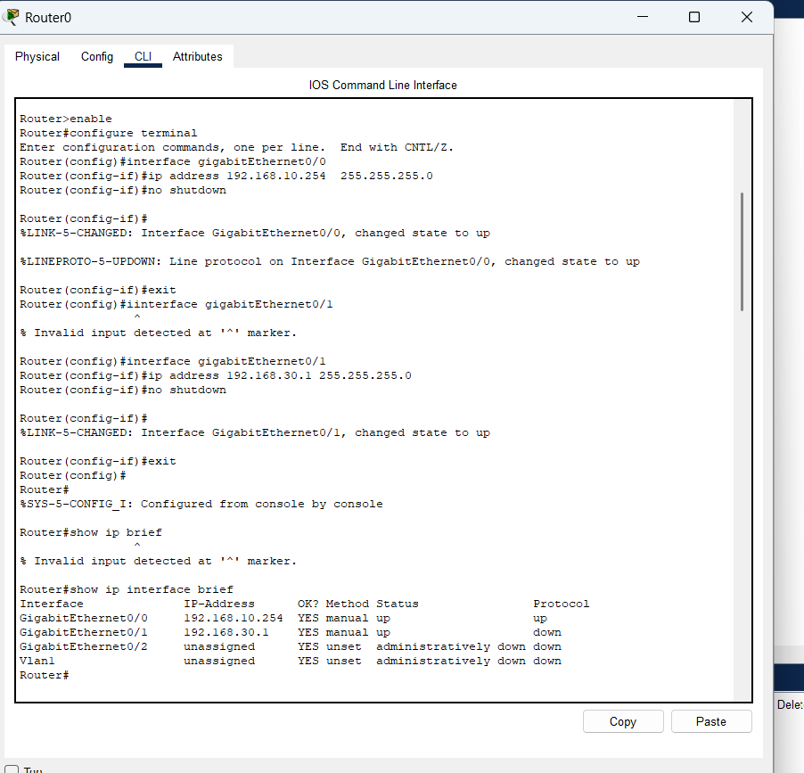

# Lab 4 - Basic Router Configuration (Inter-Network Routing)

**Objective:** Connect two separate networks using a router and verify end-to-end connectivity.

**Topology:**
- Network A: PC0, PC1 (VLAN 10) — Switch0 — Router0 (Gig0/0)
- Network B: PC4, PC5 — Switch1 — Router0 (Gig0/1)

**Router Configuration:**

interface GigabitEthernet0/0
ip address 192.168.10.254 255.255.255.0
no shutdown

interface GigabitEthernet0/1
ip address 192.168.30.1 255.255.255.0
no shutdown

**Troubleshooting notes:**
1. Interface showed up/down (protocol down) - caused by a cabling issue between Router0 and Switch1. Fixed by re-cabling the connection.
2. Ping between PC0 and Router0 failed completely - traced to a VLAN mismatch: the switch port connected to the router was still in the default VLAN instead of VLAN 10 (PC0's VLAN). Fixed by reassigning that port to VLAN 10.

**Test Results:**

Ping PC0 to Router0 (192.168.10.254): 0% loss - SUCCESS
Ping PC0 to PC5 (192.168.30.2, different network): 0% loss - SUCCESS

**Key takeaway:** A router connects different networks together, while a switch only connects devices within the same network or VLAN. Both the physical link and the VLAN assignment must be correct for routing to work.

**Status:** Completed

