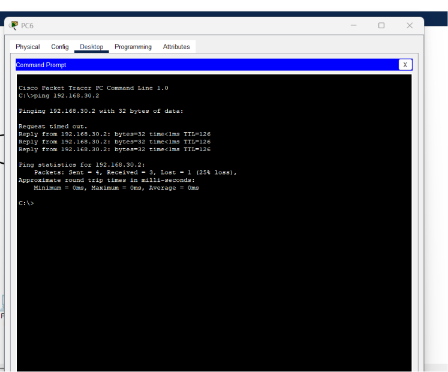
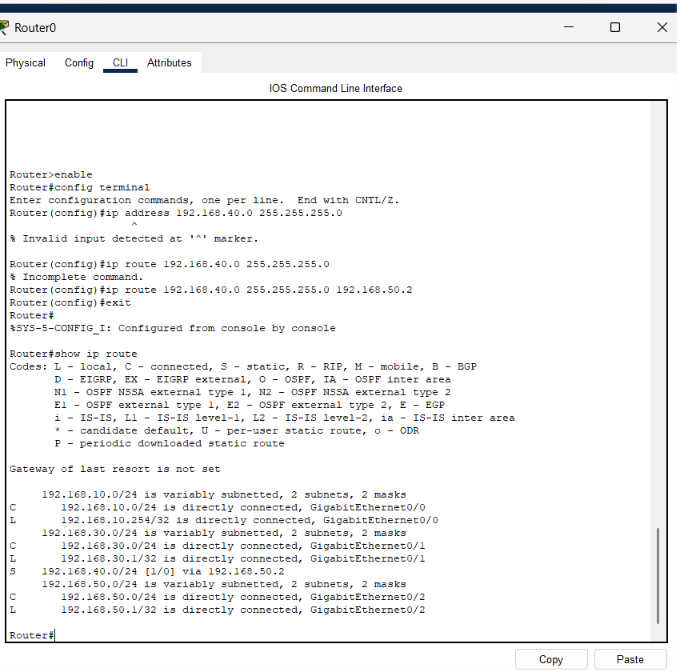
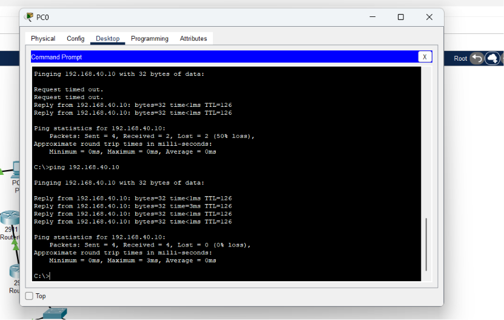
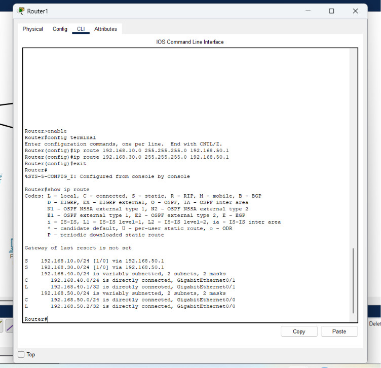
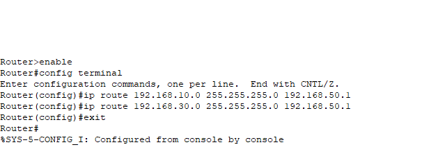

# Lab 5 - Static Routing Across Multiple Networks

**Objective:** Connect a third network using a second router and static routes, verifying end-to-end connectivity across multiple hops.

**Topology:**
- Network A: PC0, PC1 (192.168.10.0/24) - Switch0 - Router0
- Network B: PC4, PC5 (192.168.30.0/24) - Switch1 - Router0
- Router0 - Router1 (192.168.50.0/24, inter-router link)
- Network C: PC6, PC7 (192.168.40.0/24) - Switch2 - Router1

**Static Routes Configured:**

On Router0:
ip route 192.168.40.0 255.255.255.0 192.168.50.2

On Router1:
ip route 192.168.10.0 255.255.255.0 192.168.50.1
ip route 192.168.30.0 255.255.255.0 192.168.50.1

**Troubleshooting note:** Initially typed an incomplete ip route command missing the next-hop address, resulting in an Incomplete command error. Corrected by adding the next-hop IP (192.168.50.2).

**Test Results:**

Ping PC0 to Router0 (192.168.10.254): 0% loss - SUCCESS
Ping PC0 to PC5 (192.168.30.2, network B): 0% loss - SUCCESS
Ping PC0 to PC6 (192.168.40.10, network C, across 2 routers): 50% loss initially (ARP resolution delay), then successful replies - SUCCESS
Ping PC6 (network C) to PC5 (192.168.30.2, network B): 25% loss initially, then successful replies - SUCCESS (confirms bidirectional routing)

**Key takeaway:** Static routes must be configured on every router along the path for multi-hop connectivity to work. Each router only knows about networks it is directly connected to, or has been explicitly told how to reach via ip route.

**Status:** Completed

